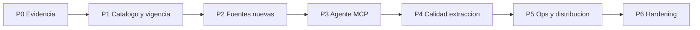

# Roadmap: robustecer MCP Legal Chile

**Principio fijo:** solo fuentes públicas sin costo de API (LeyChile/BCN, TC, OpenAlex/DOAJ/Crossref/SciELO, portales oficiales, DDG/Yahoo best-effort). PJUD/CGR sin API de texto → diseño honesto (`verified` / `candidate` / `portal_stub`).

**Estado base:** v1.13 — bugs del reporte 1.7.3 corregidos; gap principal = evidencia incompleta (PJUD/CGR link-only) + cold start Render free + ~20 tools sin resources/schemas.

**Versión del documento:** alineada con el roadmap de producto (Fase 0 en curso).

---

## Fase 0 — Evidencia verificable (2–3 semanas) — máximo ROI

Cierra el hueco que más degrada la confianza del abogado/agente.

| Ítem | Qué hacer | Archivos ancla |
|---|---|---|
| Importar fallo PJUD | Tool `importar_fallo`: texto pegado, URL HTML, PDF → parse considerandos + cache por ROL | `src/sources/jurisQuote.ts`, `src/sources/considerandos.ts`, `src/tools/jurisprudencia.ts` |
| Cache de fallos de sesión | TTL por ROL/tribunal tras importar; reutilizar en `citar_jurisprudencia` | `src/cache.ts` |
| Dictámenes CGR con extracto | Con número: scrapear ficha CGR; `verified` solo si hay cuerpo; si no `candidate` | `src/sources/dictamenes.ts` |
| Descubrimiento juris más rico | Endurecer `enrich` / `webHitsToCitations`: ROL, tribunal, año, tipo | `src/sources/jurisprudencia.ts`, `src/sources/websearch.ts`, `src/parsers.ts` |
| `verificar_cita` | Input libre (“art. 161 CT”, “Rol 1234-2023”) → status integrity + URL | tools meta / legislación |

**Criterio de listo:** smoke con fallo PJUD pegado + dictamen por número con extracto o `candidate` explícito; 0 alucinaciones de considerando (tests existentes + nuevos).

**Estado:** implementada en v1.14 (Sprint 1).

---

## Fase 1 — Catálogo, vigencia y packs (2 semanas)

| Ítem | Qué hacer |
|---|---|
| Ampliar `HOT_NORMAS` | CT, CPR, CC, CP, CPC, CPP, COT, LOB, 19.880, 18.575, 20.600, 19.628, 19.496, Ley Karin, tutela, etc. + aliases de consulta real |
| Tools hot | `listar_normas_frecuentes`, `resolver_norma_frecuente(alias)` |
| `mapa_norma` | Índice artículos + derogados + materias (envolver `obtener_texto_norma modo=indice`) |
| Vigencia por artículo | Usar flag `derogado` del XML; `estado_norma` menos “aproximado” |
| `comparar_version_norma` | Si LeyChile XML expone `fechaVersion`, diff de artículo entre versiones |
| Pack por área | `investigar_tema(area=laboral\|penal\|constitucional\|…)` sesga hot + fuentes |

Ancla: `src/catalog.ts`, `src/sources/legislacion.ts`, `src/sources/normaTexto.ts`, `src/sources/research.ts`.

**Estado:** implementada en v1.15 (Sprint 2).

---

## Fase 2 — Fuentes nuevas (3–4 semanas)

| Fuente | Entrega mínima |
|---|---|
| DT (Dirección del Trabajo) | Deep links + extracto de dictámenes laborales |
| Diario Oficial / reglamentos | Búsqueda y metadata D.S. / resoluciones vía BCN/LeyChile |
| Sernac / CMF | Circulares/oficios como `candidate` + URL oficial |
| Tratados / DD.HH. | Tool o filtro BCN dedicado |
| Doctrina LATAM | Engrosar ISSN catálogo PE/AR/MX/CO/BR en `src/sources/journalCatalog.ts` |
| Cross-link | Artículo → `normas_relacionadas` → doctrina que cite `idNorma` |

Circuit breaker: registrar hosts nuevos en `src/upstream.ts` (aislados, como LeyChile).

**Estado:** implementada en v1.17 (Sprint 4).

---

## Fase 3 — Agente MCP de primera clase (2–3 semanas)

Hoy: tools + prompts + **resources**, annotations `readOnlyHint`, progress en pack, soft elicitation y packaging npx/remoto.

| Ítem | Qué hacer |
|---|---|
| MCP Resources | Matriz honestidad, hot normas, SLOs, prompts IRAC |
| `outputSchema` | Zod → JSON estructurado además del markdown |
| Annotations | `readOnlyHint`, cuándo usar cada tool |
| Progress | Notificaciones en `investigar_tema` (~18s) |
| Elicitation | Si falta `idNorma`/ROL, pedir confirmación |
| Consolidador | Reducir solape: `buscar_*` con `dominio` enum o descripciones anti-confusión |
| Siguiente paso | Uniformar `nextStepFor` en citas/fallos (`src/present.ts`) |
| Packaging | `npx mcp-legal-chile` + snippets Cursor/Claude/Hermes |

Ancla: `src/server.ts`, `src/tools/*`, ejemplos MCP en README.

**Estado:** implementada en v1.16 (Sprint 3). Landing HTML no se tocó (hook de diseño); snippets en README + `cursor-mcp*.example.json`.

---

## Fase 4 — Calidad de extracción y anti-alucinación (2 semanas)

| Ítem | Qué hacer |
|---|---|
| Incisos/literales | Parser desde árbol XML, no solo heurística |
| Artículos bis/ter/quáter | Numeración y renumeraciones en `src/sources/normaTexto.ts` |
| Considerandos TC | Rank por query; no default al 1.º (procesal) |
| Citas formales | Variantes tribunal / Bluebook-lite / ISO además de formato chileno |
| Integrity en métricas | % `verified` vs `portal_stub` por tool en `/metrics` |
| Fixtures VCR | XML/TC/DOAJ grabados para CI offline |

**Estado:** implementada en v1.18 (Sprint 5).

---

## Fase 5 — Ops, resiliencia y distribución (continuo)

| Ítem | Qué hacer |
|---|---|
| Warmup inteligente | Más de 3 hot IDs en cola lenta (anti-429) |
| Redis en prod | Cache XML compartido (plan starter Render; filesystem efímero) |
| Región | Migrar cerca de Chile si Render lo ofrece |
| Smoke en CI | Job periódico `SMOKE_BASE=prod` midiendo 429 y P95 |
| Telemetría SLO | Alertas cuando `xml_success_rate` o P95 se rompen |
| Dominio + uptime | Dominio propio + página de estado |
| Semver alineado | README / landing / `acerca_de` / `package.json` |
| Auth opcional endurecida | Cuotas por key ya existen; documentar multi-tenant self-host |
| Seguridad | Rate limit, CORS, soft-429: auditoría periódica; no scrapers ClaveÚnica |
| Changelog | `CHANGELOG.md` por release |

Ancla: `render.yaml`, `src/index.ts`, `src/upstream.ts`, `.github/workflows/ci.yml`.

**Estado:** implementada en v1.19 (Sprint 6). Redis KV de pago y dominio/status page quedan opcionales/documentados.

---

## Fase 6 — Robustez “completa” (hardening extra)

Más allá de features: lo que convierte el MCP en infraestructura confiable.

1. **Contrato de honesty e2e:** `enforceVerifiedHasText` demote verified→candidate sin texto; tests e2e.
2. **Degradación ordenada:** circuitos por host (`src/upstream.ts`); packs parciales; docs en README.
3. **Budgets configurables:** `investigar_tema(perfil=fast|default|deep)` + `PACK_PROFILE` / `PACK_FAST_MS` / `PACK_DEEP_MS`.
4. **Idempotencia y singleflight:** cache XML con singleflight in-memory (+ Redis opcional).
5. **Observabilidad:** `X-Request-Id` en `/mcp`; logs `mcp_request_*` con `requestId` + tool.
6. **Compatibilidad de protocolo:** pin `@modelcontextprotocol/sdk` + suite MCP en tests.
7. **Limitaciones legales:** aviso PJUD/CGR/DT + ToS en README; política anti-alucinación.
8. **Suite 30 queries abogado:** `tests/fixtures/lawyer-queries.json` + `tests/fase6Queries.test.mjs`.
9. **Modo offline/demo:** `DEMO_MODE=1` sirve fixtures hot (p.ej. CPR/CC) sin LeyChile.
10. **Extensibilidad:** `SourceAdapter` + registry DT/CGR/SERNAC/CMF (`src/sources/adapter.ts`).

**Estado:** implementada en v1.20 (Sprint 7); integrada en main como **v1.22.0** (junto a workflow/PJUD de 1.15–1.21).

---

## Priorización de sprints sugerida

| Sprint | Foco | Salida visible |
|---|---|---|
| S1 | Fase 0 (importar fallo + CGR + verificar_cita) | Citar PJUD sin inventar — **hecho (v1.14)** |
| S2 | Fase 1 (hot + mapa + vigencia + área) | Latencia y precisión normativa — **hecho (v1.15)** |
| S3 | Fase 3 (resources, schemas, progress) | Mejor uso por agentes — **hecho (v1.16)** |
| S4 | Fase 2 (DT + reglamentos + LATAM) | Más cobertura — **hecho (v1.17)** |
| S5 | Fase 4 + fixtures VCR | Calidad y CI sólido — **hecho (v1.18)** |
| S6 | Fase 5 (warmup, smoke CI, CHANGELOG) | Ops — **hecho (v1.19)** |
| S7 | Fase 6 (honesty e2e, adapters, offline) | Hardening extra — **hecho (v1.20 → main v1.22)** |

---

## Fuera de alcance (explícito)

- APIs de pago (vLex, Serper, Brave, Trifolia).
- Scrapers PJUD con ClaveÚnica / automatización de login.
- Sustituir asesoría jurídica humana.
- Reescribir el servidor en otro lenguaje.

---

## Métricas de éxito del roadmap

- % resultados `verified` en flujos legislacion+TC > umbral acordado (p.ej. 80% en smoke hot).
- P95 `obtener_articulo` cache hit < 500ms; cold < 5s (SLO actual).
- `investigar_tema` siempre < `PACK_TOTAL_MS` con sección “qué falta verificar”.
- 0 casos de considerando inventado en tests.
- Smoke prod diario verde ≥ 95% días/mes.
